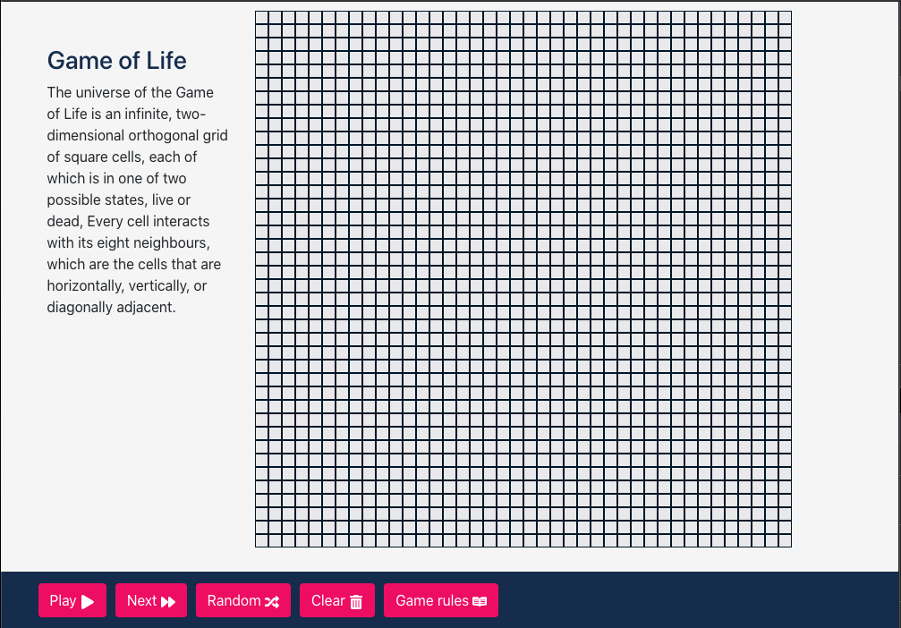

## Game of Life
The universe of the Game of Life is an infinite,two-dimensional orthogonal grid of square cells,
each of which is in one of two possible states, live or dead,
Every cell interacts with its eight neighbours, which are the cells that are horizontally,vertically, or diagonally adjacent.

### Usage

Clone the repo

    $ git clone https://github.com/luorlandini/the-game-of-life.git

    $ cd the-game-of-life

#### Start

    $ yarn start / npm start
### Requirements

git client

node >= 10.16.0

yarn or npm